# Pos-Mutama


Aplikasi kasir (Point of Sale) offline yang dirancang khusus untuk toko bahan bangunan, dibangun menggunakan Flutter. Aplikasi ini memungkinkan pengelolaan inventaris, transaksi, pelanggan, dan laporan penjualan secara efisien tanpa memerlukan koneksi internet.

## Fitur Utama

-   **Point of Sale (Kasir)**: Antarmuka kasir yang intuitif untuk memproses transaksi penjualan dengan cepat.
-   **Manajemen Inventaris**:
    -   Menambah, mengubah, dan menghapus item barang.
    -   Dukungan **multi-satuan** untuk satu item (contoh: Pcs, Lusin, Dus) dengan harga dan konversi yang berbeda.
    -   Pencatatan stok berdasarkan satuan terkecil untuk akurasi.
    -   Dukungan pemindaian barcode untuk pencarian dan penambahan item.
-   **Manajemen Pelanggan**:
    -   Menyimpan data pelanggan (nama, telepon, alamat).
    -   Pencatatan dan pelacakan transaksi utang atau DP per pelanggan.
-   **Laporan & Dasbor**:
    -   Visualisasi data penjualan dalam bentuk grafik.
    -   Filter laporan berdasarkan periode waktu (harian, mingguan, bulanan, dll).
    -   Menghitung total pendapatan dan keuntungan.
-   **Manajemen Data**:
    -   Ekspor dan Impor data item melalui file CSV.
    -   Backup dan Restore seluruh data aplikasi (item, transaksi, pelanggan) ke sebuah file JSON.
    -   Fitur auto-backup mingguan untuk keamanan data.
-   **Cetak & Bagikan Struk**:
    -   Membuat struk dalam format PDF untuk printer termal ukuran 80mm.
    -   Membagikan struk sebagai file PDF melalui aplikasi lain.

## Arsitektur & Teknologi

-   **Framework**: Flutter
-   **State Management**: Flutter Riverpod
-   **Database Lokal**: Hive
-   **Dependensi Kunci**:
    -   `mobile_scanner`: Untuk fungsionalitas pindai barcode.
    -   `csv`, `file_picker`, `file_saver`: Untuk impor/ekspor data.
    -   `pdf`, `printing`: Untuk pembuatan dan pencetakan struk.
    -   `fl_chart`: Untuk visualisasi data laporan.

## Konfigurasi Proyek

Sebelum menjalankan proyek, ada beberapa hal yang perlu diperhatikan:

1.  **Penggunaan Pertama Kali**: Saat aplikasi dijalankan untuk pertama kalinya, pengguna akan diarahkan ke layar pengaturan informasi toko (`StoreSetupScreen`) yang wajib diisi.

2.  **Code Generation**: Proyek ini menggunakan `hive_generator` untuk membuat file adapter (`.g.dart`). Jika Anda melakukan perubahan pada *model* di direktori `lib/models`, jalankan perintah berikut untuk memperbarui file yang di-generate:
    ```bash
    flutter pub run build_runner build --delete-conflicting-outputs
    ```

## Cara Build Aplikasi

Metode yang paling direkomendasikan untuk membuat file APK adalah melalui GitHub Actions yang sudah dikonfigurasi.

### Metode 1: Build melalui GitHub Actions (Direkomendasikan)

Alur kerja (workflow) telah diatur untuk secara otomatis membuat APK versi rilis setiap kali ada *push* ke *branch* `main`.

1.  Lakukan `git push` ke branch `main` di repositori GitHub Anda.
2.  Buka tab **Actions** di halaman repositori GitHub.
3.  Cari alur kerja bernama **"Build Flutter Android APK"** yang sedang berjalan atau sudah selesai.
4.  Setelah selesai, klik pada alur kerja tersebut. Di bagian bawah halaman, Anda akan menemukan bagian **Artifacts**.
5.  Unduh artifact bernama `release-apk`. File `app-release.apk` akan berada di dalam file zip yang Anda unduh.

### Metode 2: Build Lokal (Untuk Pengembangan)

Anda bisa melakukan build secara lokal, namun perlu diperhatikan bahwa konfigurasi rilis saat ini menggunakan kunci debug. Ini cukup untuk pengujian, tetapi **tidak disarankan untuk distribusi publik**.

-   **Analisis**: File `android/app/build.gradle.kts` menunjukkan bahwa `buildTypes.release` menggunakan `signingConfigs.getByName("debug")`. Ini berarti APK rilis yang dihasilkan dari build lokal akan ditandatangani dengan kunci debug standar, bukan kunci rilis pribadi.

-   **Perintah Build**: Untuk membuat APK menggunakan konfigurasi ini, jalankan perintah berikut di terminal:
    ```bash
    flutter build apk --release
    ```
-   **Lokasi APK**: File APK akan tersedia di `build/app/outputs/flutter-apk/app-release.apk`.

-   **Untuk Build Produksi Lokal**: Jika Anda ingin melakukan build dengan kunci rilis pribadi, Anda perlu:
    1.  Membuat keystore rilis Anda sendiri.
    2.  Membuat file `key.properties` di dalam direktori `android`.
    3.  Mengubah konfigurasi di `android/app/build.gradle.kts` untuk membaca properti dari `key.properties` dan menggunakannya untuk menandatangani build rilis.
    4.  Ikuti panduan resmi Flutter tentang [Build and release an Android app](https://docs.flutter.dev/deployment/android).

# Dokumentasi
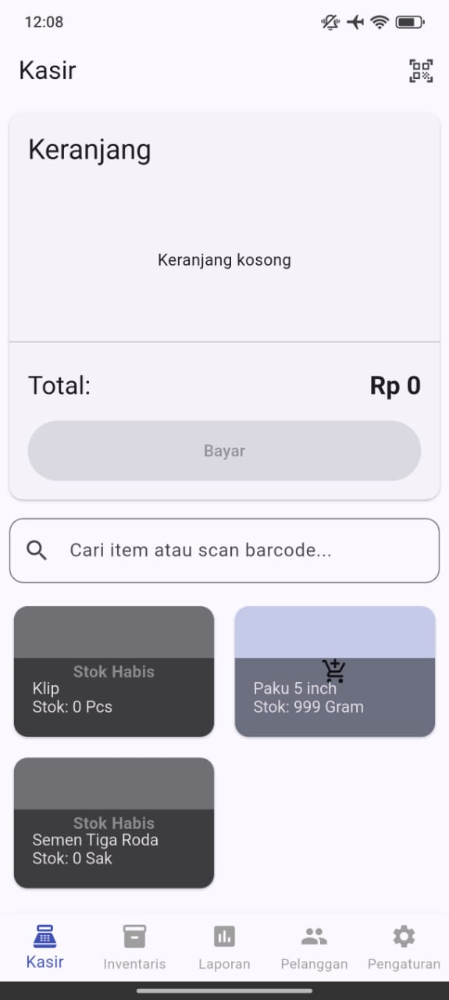

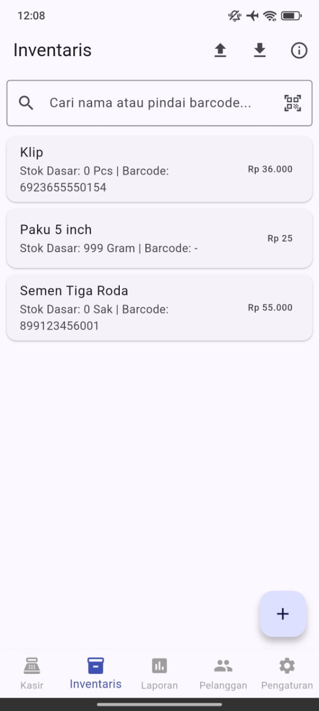
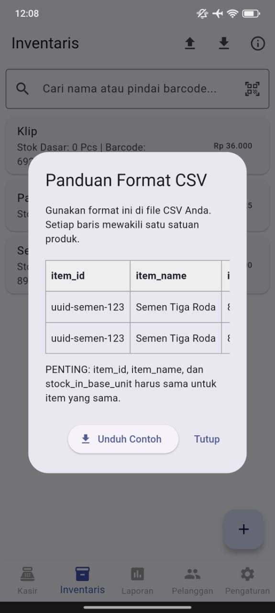
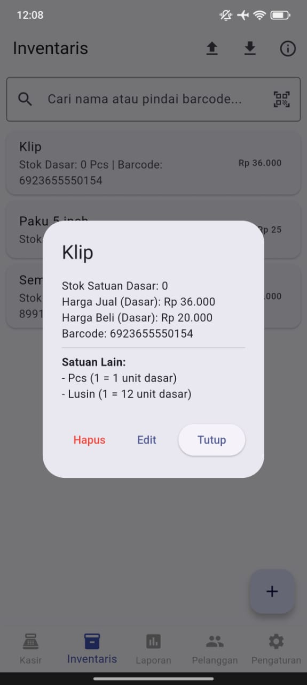
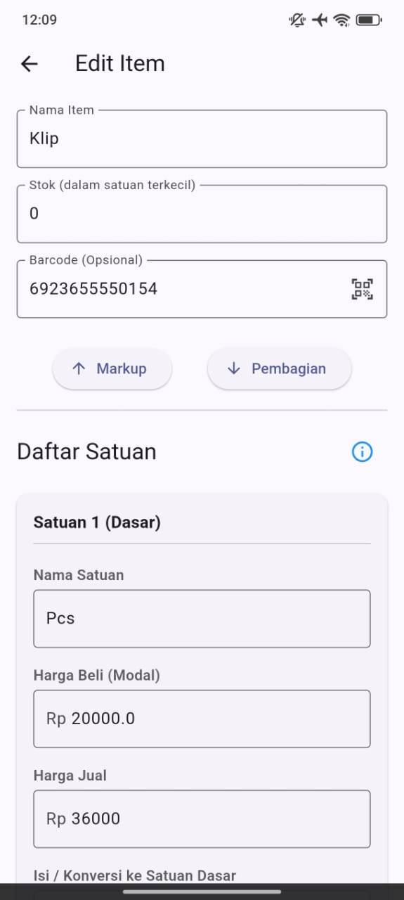
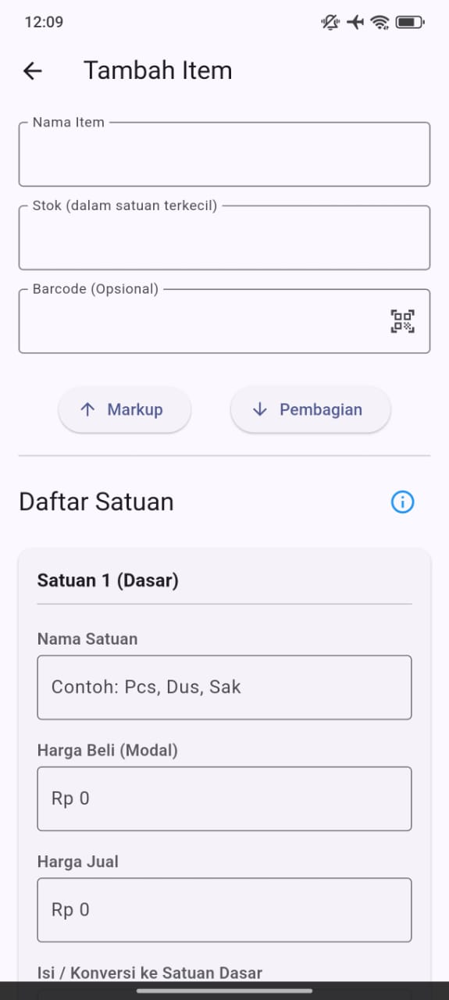
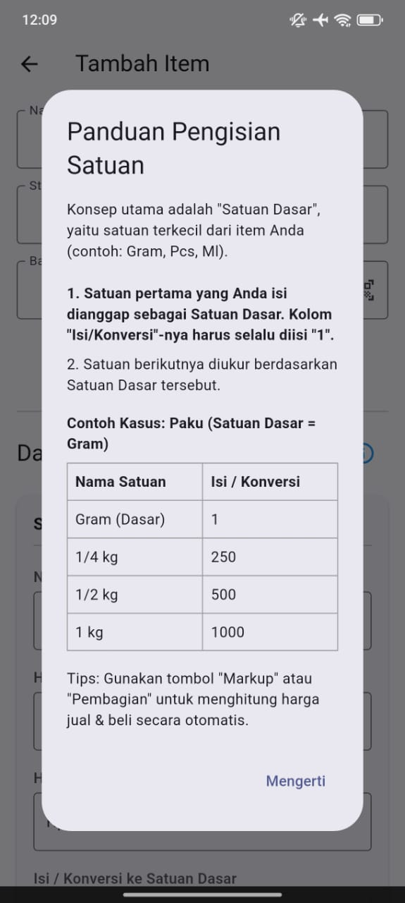
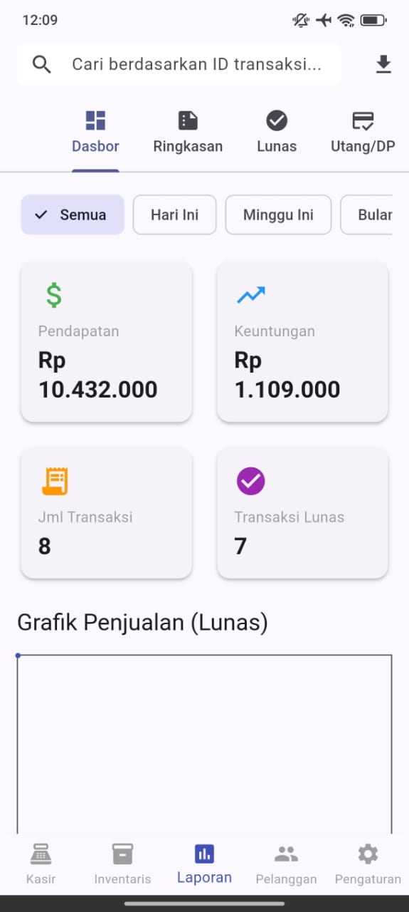

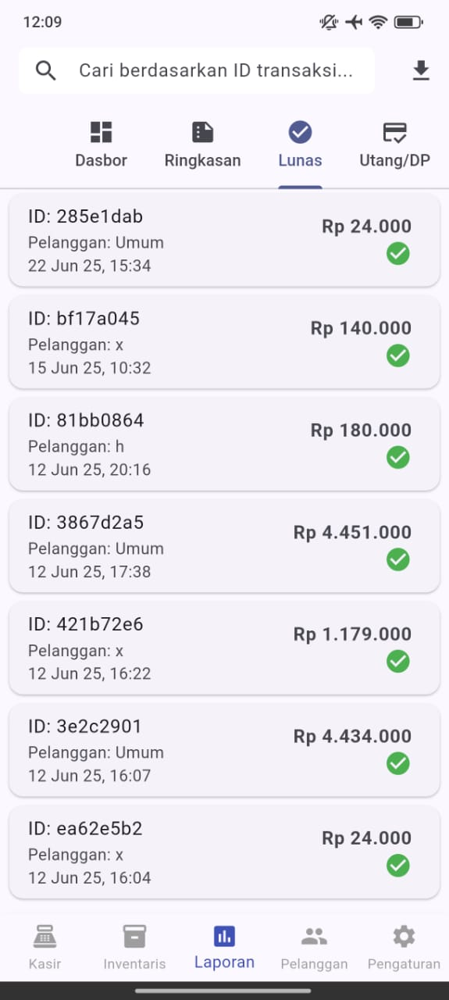
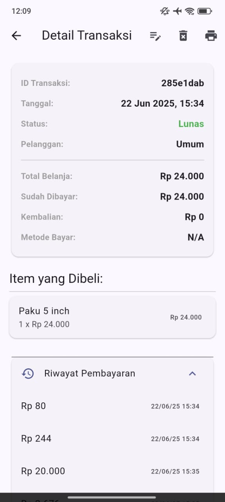
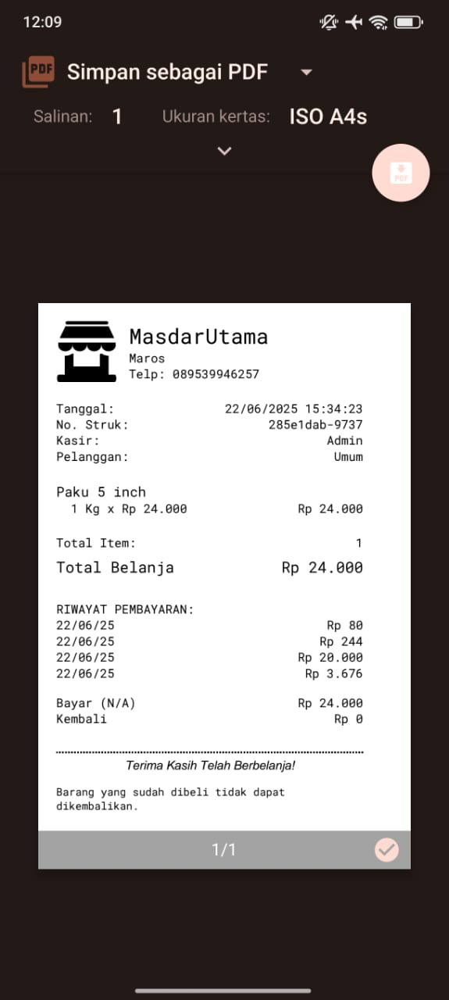

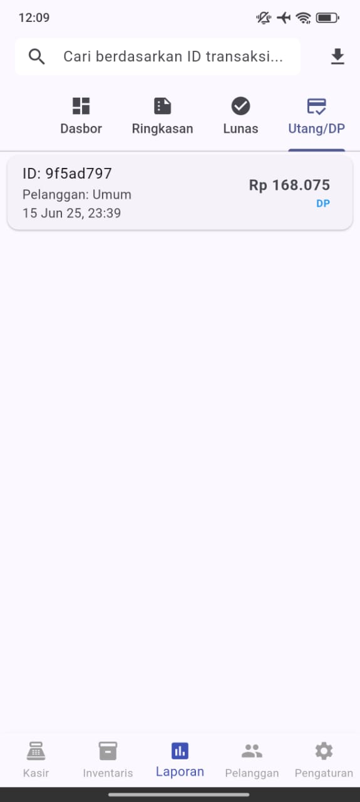
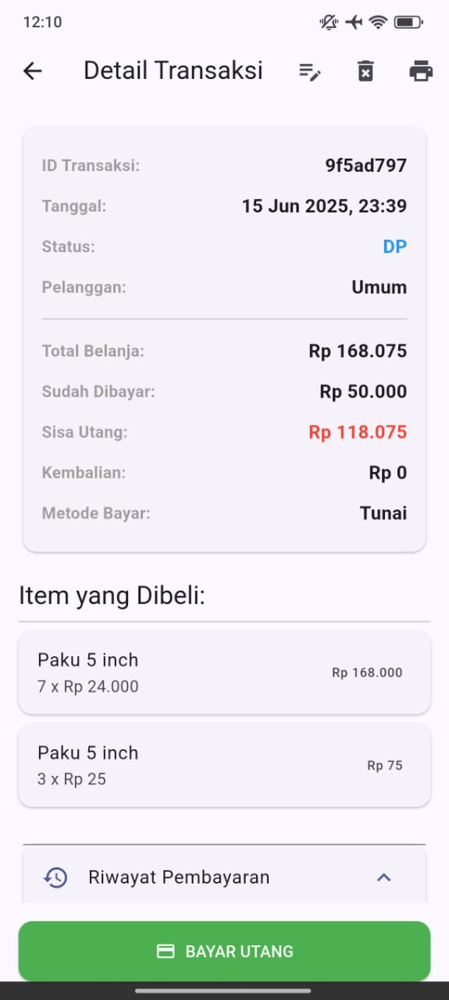
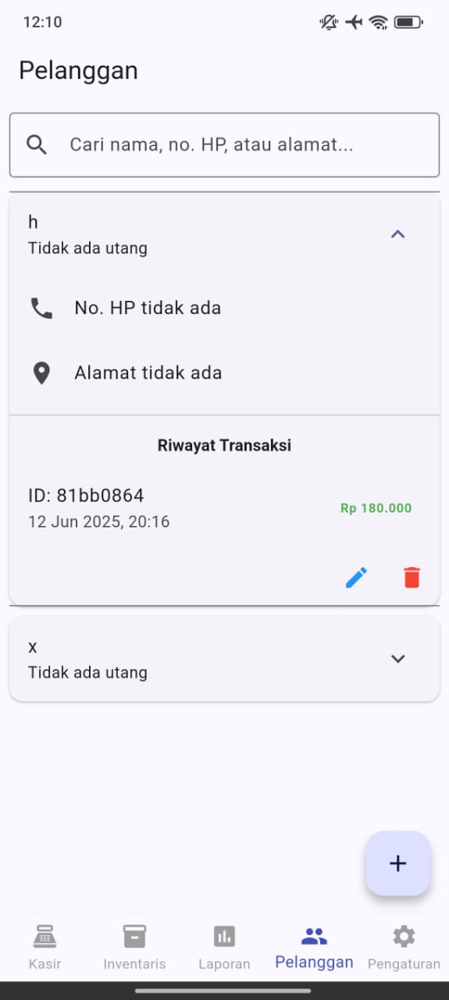
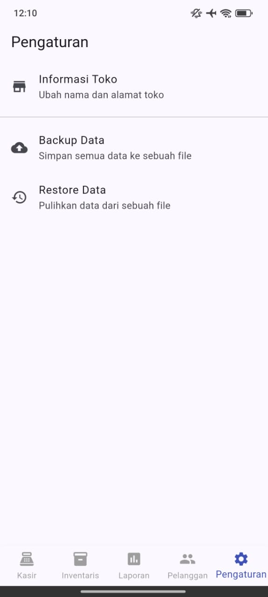
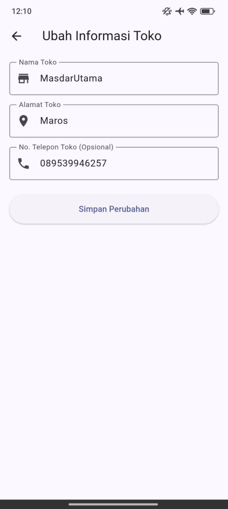